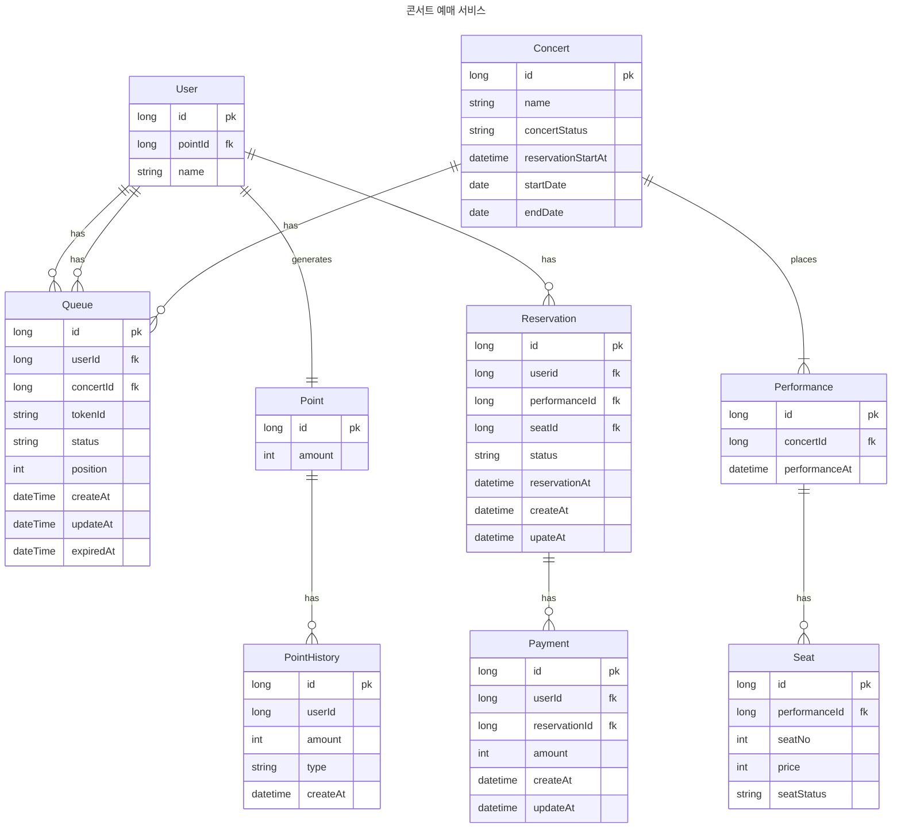

# ERD 설계
## 1. ERD

## 2. 관계 설명
 ### 큐(QUEUE)
 - 사용자가 여러 콘서트에 대해 동시에 예약을 시도할수있기때문에 userId, concertId 컬럼이 필요하다고 생각해 추가하였습니다.
 - User(회원)과 Queue(대기열)는 1:N 관계를 가집니다.
 - Concert(콘서트)와 Queue(대기열)는 1:N 관계를 가집니다.

 ### 콘서트 서비스
 - Concert(콘서트)와 Performance(공연)는 1:N 관계를 가집니다.
    - 콘서트별 회차정보, 공연시작시간 고려하여 작성하였습니다
 - Performance(공연)와 Seat(좌석)는 1:N 관계를 가집니다.

 ### 예약 서비스
 - Reservation(예약)은 Payment와 has(0~N) 관계를 가집니다.
   - 예약 후 결제를 진행하지 않은 경우, 결제 취소를 고려하여 작성하였습니다.

 