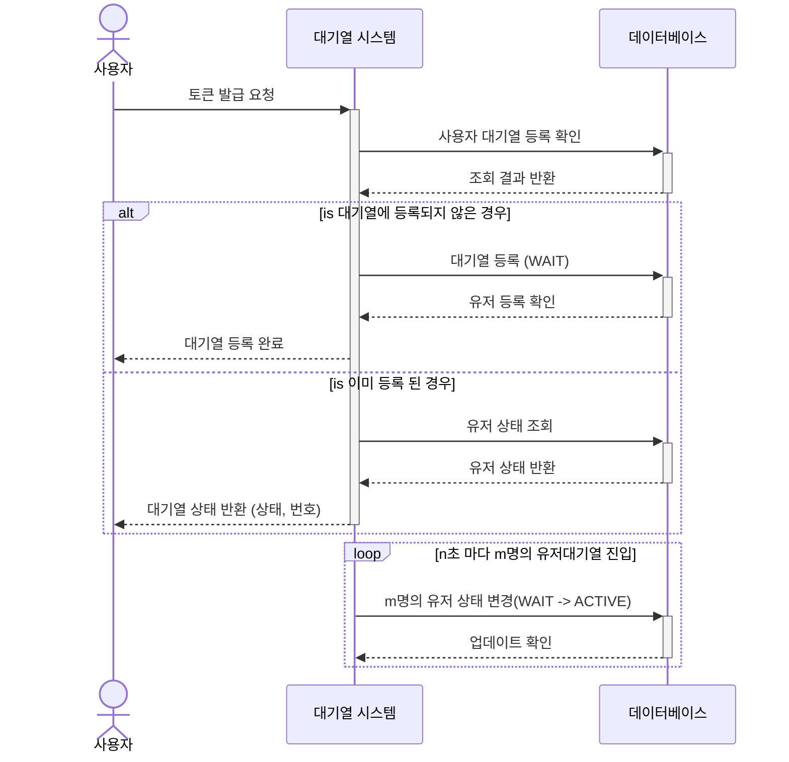
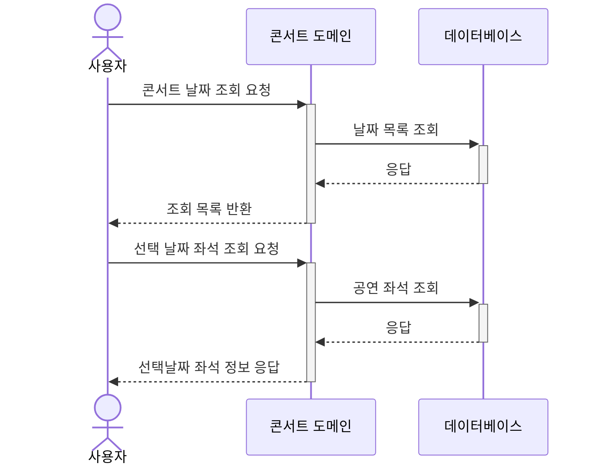
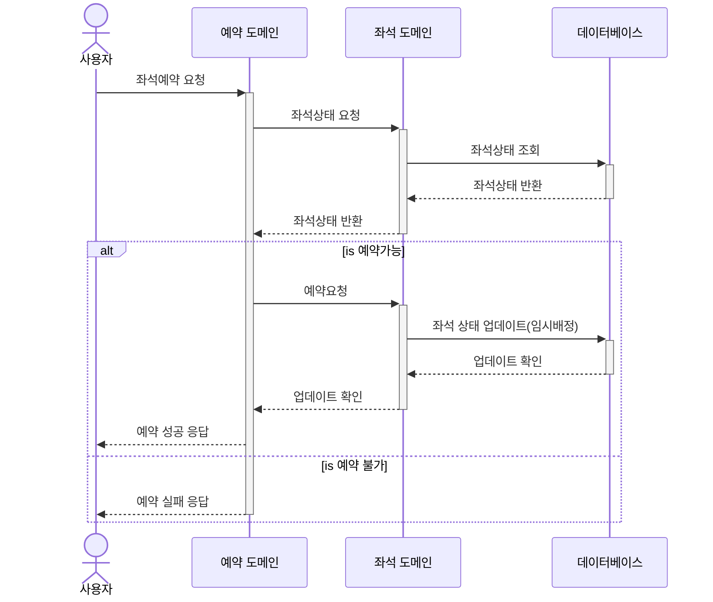
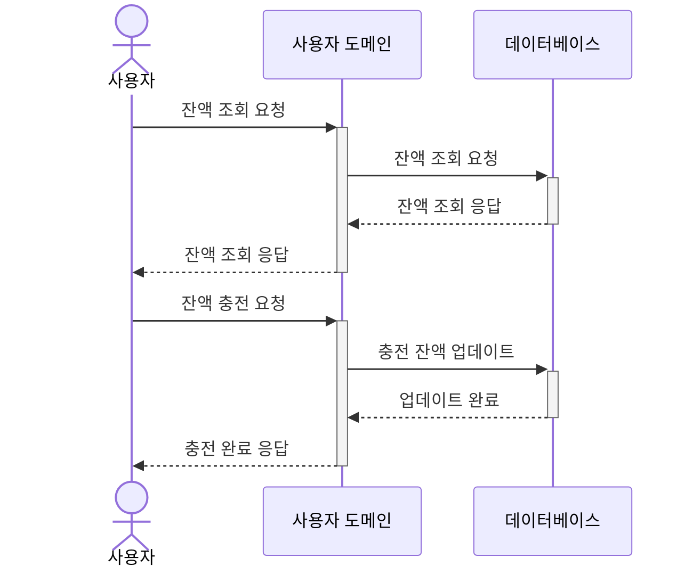
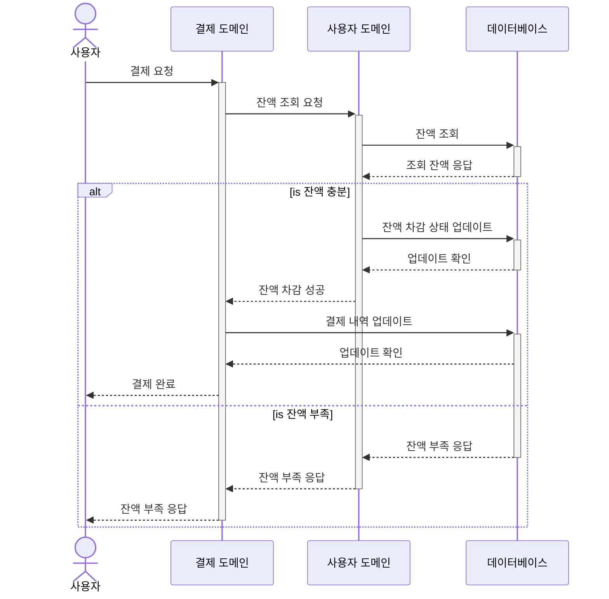

# 콘서트 티켓팅 시퀀스 다이어그램

## 1.대기열 토큰 발급/조회
 > [!NOTE]
 > 놀이공원(유량제어) 방식 대기열 구현으로 표현
1. 사용자는 토큰 발급 API 호출합니다.
2. 대기열 도메인에서 데이터베이스에 사용자 정보로 대기열에 등록되어있는지 조회를 요청합니다.
3. 조회 결과에 따라 
    - 대기열에 등록되지 않은경우
        - 대기열에 사용자를 등록합니다. (WAIT 상태)
    - 이미 등록된 경우
        - 대기열에 등록된 사용자 상태를 반환합니다.
4. 사용자에게 토큰을 반환합니다.

## 2.예약가능 날짜 조회

## 3.좌석예약 요청

## 4.잔액 조회/충전 요청

## 5. 결제 API
> 좌석예약에서 이미 좌석상태에 대해 검증했기 때문에 결제만 진행
1. 사용자는 결제 요청을 합니다.
2. 결제 도메인은 사용자 도메인에 잔액 조회를 요청하여 데이터베이스에서 잔액을 조회합니다.
3. 반환 결과에따라
    - 잔액이 충분한경우
        - 사용자 잔액에서 결제 잔액을 뺀 금액을 업데이트합니다.
        - 잔액 차감에 성공하면 결제도메인에서 결제내역 업데이트를 요청합니다.
        - 완료되면 성공 결과를 반환합니다.
    - 잔액이 부족한경우
        - 잔액이 부족하여 실패한 결과를 반환합니다.

